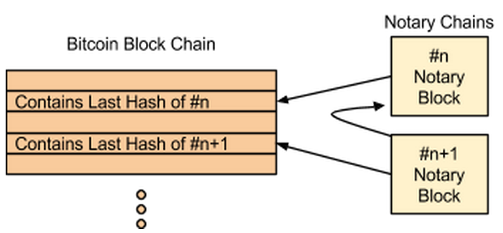
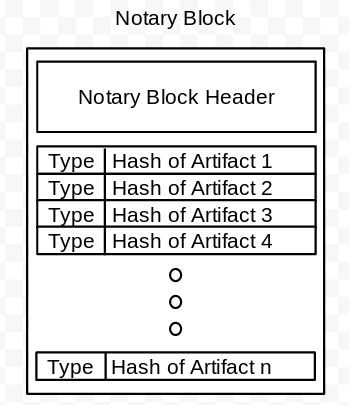
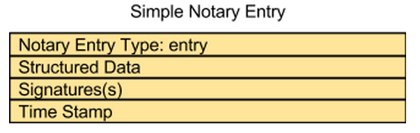
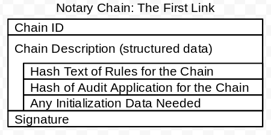
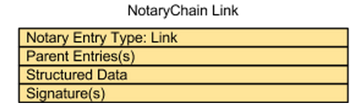

NotaryChains
============
*Proof of Process*

Abstract
--------

NotaryChains as a design resulted from an effort to distill the design of a framework down to its most simple and basic components.  The result is a general Protocol Stack for building new currencies, smart contracts, smart properties, etc.  

The most basic layer in this protocol stack collects into a "notary block" the hashes of digital artifacts (spreadsheets, text files, structured data, media, etc.).  This notary block is hashed itself, and that hash is placed into the Bitcoin block chain, and a new notary block is begun.  Because hashes are one way functions, the existence of the hash in the Bitcoin block chain is proof that all the hashes in the notary block existed at that time.  This is because you can create a hash from a digital artifact, but you cannot fit a digital artifact to an existing hash.  Likewise, the existence of a hash in a notary block proves the existence of the digital artifact.  The construction of notary blocks limits the data entered into the Bitcoin block chain.

The "entry layer" sits on top of the proof of existence layer to provide the user with a structure for holding meta data about what is being secured by the proof of existence layer, and the Bitcoin blockchain. 

The "notary chain" layer allows the linking of entries together, and it specifies the rules required for these links.  Each notary chain then can have its own rules governing what entries are accepted as links in that chain.  

NotaryChains are run upon a set of federated servers that implement a set of policies that drive their behaviors.  These polices are subject to real time audits, and the NotaryChain servers use a system of audits to provide users proof that the servers are implementing these policies.  This system of audits is referred to as Proof by Audit. 

Introduction
------------

Bitcoin is disrupting the status quo for online payments.  With Bitcoin, payments can be made worldwide without any centralized party or parties.  The success and elegance of Bitcoin has inspired many others to seek ways of decentralizing more than just payment systems.  Many have observed that the blockchain could enable the trading of commodities, trading of assets, issuing  securities, implementing self enforcing smart contracts, crowd sourced loans, etc.  The set of such extended applications is often referred to as "Bitcoin 2.0"

NotaryChains simplifies how Bitcoin 2.0 applications can be deployed.   NotaryChains seek to solve the foundational problem of Bitcoin 2.0.   NotaryChains do so by providing a few simple operators from which many more complicated operations can be built.  NotaryChains extends Bitcoin beyond the exchange of bitcoins to include the recording and management of arbitrary events (entries in NotaryChains), and chains of such events (sequences of entries referred to as notary chains).

Consider what any Bitcoin 2.0 application requires:

* Structured events that may include additional information beyond that captured by a Bitcoin transaction.
* An ordered, cryptographically secured public ledger recording each event 
* Unambiguously defined sequences of events
* Unambiguously defined rules governing sequences of events
* Auditable events, and event sequences, either publicly or privately

NotaryChains is designed to meet these requirements.  NotaryChains implements a Protocol Stack for Bitcoin 2.0 Applications.  The layers in this stack are:

4) Applications

3) Notary chains

2) Event structure

1) Notary layer 

**The Notary Layer**

The Notary layer implements proof of existence for an digital artifact.  Any event, document, image, recording, etc. that is defined in a digital representation can be hashed.  That hash can be recorded in the notary layer.  Because of the vast difficulty and complexity of finding a digital document that will fit a particular hash, the mere recording of such a hash is proof of the digital document’s existence at the time of the recording of the hash.

NotaryChains collects sets of such hashes into a notary block.  The notary block is then hashed, and that hash is recorded into the Bitcoin block chain.  This allows the most minimum expansion of the Bitcoin block chain, yet the ledger itself becomes as secure as Bitcoin itself.  Furthermore, since NotaryChains can be maintained more cheaply in terms of resources, the cost of entries into the notary layer will be much cheaper than transactions in the Bitcoin block chain.

**Event Structure**

Bitcoin 2.0 applications will need to record a varied range of information with the event itself.  Encoding all that information into the Bitcoin block chain is unreasonable, yet some entries may need to be part of the event itself rather than be held off chain.   NotaryChains allow the application to define the event structure, and manage that structure in the notary chains. 

**Notary Chains**

Notary chains are chains of entries that define sequences of events.  These sequences are at the heart of Bitcoin 2.0.  Defining what an event is, and what is required for following events is basic to all event sequences (even outside of Bitcoin 2.0).  Notary chains document and validate these event sequences to provide an audit trail that can prove an event sequence occurred.  NotaryChains support three levels of notary chains (i.e. notary chains, i.e. sequences of entries):

*Enforced Notary Chains*

Some sorts of event sequences are very coommon.  These common sorts of sequences are defined as part of the NotaryChain servers, such that these notary chains are enforced directly.  As development on the NotaryChains technology continues, the set of enforced sequence types will be expanded.  

Bitcoin is an example of a protocol that implements a particular server enforced event sequence.  Any transaction that does not validate against the Bitcoin block chain is excluded. NotaryChains provides that same sort of enforcement of enforced notary chains.  Any attempt to add an event to an enforced sequence that breaks the rules of that sequence type is rejected by the NotaryChains servers, and is not added as an entry, and thus bared from being part of the notary chain. 

Initially NotaryChains will implement these sequence types:

* Account -- maintains a balance, which is decremented as used
* Ticket -- allows for issuing, transferring, and consuming tickets until a particular date and time
* Coin -- allows for the issuing and trading of coins
* Notes -- a sequence that allows information to be recorded about another event. 
* Log -- a sequence restricting entry to a set of signatures

*Independent but public enforced sequences*

The first event beginning a chain will provide a hash of a human readable list of rules for the NotaryChain. The first event will also provide a hash of a script or an application that can be run to validate entries in the sequence.  The description of the event will provide a link to these rules, scripts, and applications.

An enforced sequence can be specified.  Entries that cannot meet the requirements of the specified enforced sequence will be rejected.  However, entries that might be rejected by the script or the app will still be recorded.  Thus users of such chains will need to run the app or script to validate a chain sequence of this type. The NotaryChain servers will not validate using the script or app.

As new public enforced sequences become popular, they can be added to the set of enforced sequences.

*Private enforced sequences*

These sequences are identical to the public enforced sequences, only the readable list of rules, scripts, and applications are only provided as hashes.  Users with access to the rules, scripts and applications can validate them via the first event in such a NotaryChain, but the links to them are not provided by the NotaryChain.

This is useful for testing, or for documenting and driving private transactions. 
Applications
Using these operators and facilities, Distributed Autonomous Applications (DAPPs) and Distributed Autonomous Organizations (DAOs) can be constructed.  But even everyday sorts of uses can be facilitated as well, like simple movie tickets or arcade tokens.  Notary Chains can support:

* Crowd sourcing loans
* Issuing securities and paying dividends 
* Powerful scripted chains with functionality like Ethereum, Darkcoin, etc.
* Smart Contracts
* Smart Properties
* Event ticketing

#Discussion

Using Bitcoin to prove the existence of a document (really any digital asset, like a tweet, a web page, a spreadsheet, a security video, a photo, etc.) is a concept that is well known.  (See the references at the end of this document).  And some have even suggested that a service could be created to take a list of signatures, compute a merkle root, place that in the Bitcoin block chain.  This not only provides the same security, but limits the “block chain Pollution” of pushing a hash into the blockchain for every signed document.  There are at least a couple of online websites that provide these services.

NotaryChains provide for simple “proof of existence” entries.  In addition, NotaryChains provide proof of transform.  NotaryChains implement validation scripts that allow for chains of notarized entries.   NotaryChains can be used to implement token systems, asset trading systems, smart contracts, and more.   A federated set of NotaryChain servers provide for real time audits, easy transfer from one NotaryChain server to another, reduced blockchain pollution, and other benefits.

Bitcoin implements a strict, distributed method for the validation of transactions, where anyone can validate each transaction, and the validity of every input into a transaction can be verified.  Because each transaction is authorized via cryptographic signatures, no transaction can be arbitrarily reversed.  Furthermore, the meaning of each transaction is defined as a validation of the input values (amounts of bitcoin) for each transaction.

The Bitcoin protocol is transactionally complete.  In other words, the creation and distribution of Bitcoins through transactions is completely defined within the Bitcoin protocol.  Transactions (which specify movement of bitcoin) and block discovery (which move bitcoin via mining fees and provide block rewards) are the only inputs into the Bitcoin Protocol, and nothing leaves the Bitcoin Protocol.  In other words, the 21 million Bitcoin that will ultimately exist will always and forever exist within the protocol.  (Well, at least until side chains are implemented, which will provide additional movement of Bitcoin in and out of side chains.)

Many different groups are looking to find ways to leverage the Bitcoin approach for managing other sorts of transactions besides tracking bitcoin balances.  For example, the trading of assets such as houses or cars can be done digitally using Bitcoin.  Even the trading of Commodities such as precious metals, futures, or securities might be done via clever encoding and inserting of information into the Bitcoin blockchain.  

Efforts to expand Bitcoin to cover these kinds of trades include Colored Coins,  Mastercoin, and Counterparty.  Others seek to build their own cryptocurrency with a more flexible protocol that can handle trades beyond currency.  These include Namecoin, Ripple, Etherium, BitShares, NXT, and others.  And of course Open Transactions uses Cryptographic signatures and signed receipts and proof of balance for users (i.e. a user does not need the transaction history to prove their balance, just the last receipt). 

A NotaryChain seeks to gain the ability to track assets and implement contracts, while securing the advantage Bitcoin’s security via Bitcoin block chain.  Instead of inserting transactions into the Blockchain (viewed as “Blockchain Pollution” by many), NotaryChains keep most information off blockchain.  Furthermore, the NotaryChain provides a record keeping system that minimizes the information any actor has to maintain to validate their NotaryChains of interest.  In short,   NotaryChains utilize a combination of mathematical proofs and hashes within the NotaryChains, while inserting the least amount of information into Bitcoin block chain.  The goal is to create an system of records whose audit trails can prove the interactions of NotaryChain users.

A user only needs the artifacts of the NotaryChain of interest rather than the full set of NotaryChains maintained by the NotaryChain servers.

Of course, the NotaryChain can notarize documents, providing proof of their existence at a point in time, and validating their construction (any modification will be detected).  In addition, a NotaryChain provides a provable history, a chain of time stamped events, i.e. a series of entries (i.e. a NotaryChain) that proves a series of events occurred.   This allows a NotaryChain to implement smart contracts and even alternate currencies.  All of which can clear instantly (assuming trust in the NotaryChain servers), and within minutes once a notary entry is secured via the Bitcoin Blockchain.

The NotaryChains are maintained on a set of federated, independently controlled NotaryChain servers.  NotaryChains borrows from the concept of Private Chains, and allows for reactive security by limiting the ability of any NotaryChain server to fail to log entries without immediate detection by not only the other NotaryChain servers, but by the users themselves.  And like Open Transactions, all links in a chain are secured with cryptographic signatures; there is no opportunity for a NotaryChain server to insert a bogus transaction. 

Furthermore, a NotaryChain is largely left ignorant of the significance of any transaction.  The management and backing of any NotaryChain is left to the users of the service.  The NotaryChain is an automated, powerless, and disinterested party to the transformations of a particular NotaryChain.

The NotaryChain concept is designed to allow many different protocols and rules to be run in parallel within data structures designed and implemented by its users.  At the same time, the integrity of the system is secured with the Bitcoin block chain.  NotaryChains also limit the amount of “pollution” to the blockchain that would result if the same data and information were encoded into Bitcoin Transactions.  Additionally, the NotaryChain seeks to reduce the overhead of a single blockchain for sets of transactions that have little to do with one another.  In other words, while Bitcoin benefits from thousands of computers holding the full blockchain, many applications simply need to be auditable, with far fewer systems holding the entire Notary History.  Thus NotaryChains significantly reduce the resources required to process transactions while providing nearly instant transaction clearing.  Federated NotaryChain Servers provide for distributing NotaryChain processing, load balancing, real time audits to insure honesty, and redundancy to insure availability.

Initially, NotaryChain servers will provide APIs to query information from the NotaryChain as needed.  Tools for analyzing the NotaryChain and torrents for distributing the NotaryChain will also be provided.  As technologies such as MaidSafe and the Safe Network come online, then NotaryChain data can be published there in a way that insures all the Notary Blocks are available going forward, despite the fate of any particular NotaryChain Server.

Yet even if the data in NotaryChain servers expand to many terabytes in size, the validity of Notary Entries and particular Notary Chains are only going to require a small portion of that data.

#How NotaryChains Work



*Figure 1: Diagram showing that Notary Blocks are linked together, and the has of each Notary Block is inserted into the Bitcoin Block Chain.*

The proof of existence hashes are held within a series of Notary Blocks.  Every so often, the current notary block is hashed, and that hash is inserted into the Bitcoin Block Chain, as shown by Figure 1.  The periodic hash is all that is inserted into the Bitcoin Blockchain.  With the single hash, the Notary Block can be provably unalterable (as it would break the hash recorded in the Bitcoin Block Chain).  We are looking at different ways to create a link to this hash from the notary block. 

A Notary Block is created immediately after the previous Notary Block is slated to have its Hash submitted to the Bitcoin BlockChain.  A new Notary Block begins with a Block ID (one greater than the last).



*Figure 2:  Internal structure of a Notary Block.*

As each Notary Entry is submitted, it is added to the Notary Block, along with a type, and a timestamp.  For a simple proof of existence entry, the type will be 0.  Other types provide indexes and information that link to information held in entries and chains.

#A Simple Notary Entry

Any number of Notary entries can be added to a Notary Block, and remain secured by the Bitcoin Blockchain.  This vastly reduces the overhead of notary functions on the Bitcoin Blockchain without significant loss of security for the notary entries themselves.  We will discuss how the Notary Blocks are published in a later section.  But suffice it to say that anyone holding a copy of a Notary Block can prove its validity by simply providing the Bitcoin Transaction holding the block’s hash.  The block could not possibly have been constructed after the fact (as fitting a block’s contents to produce an existing hash is quite out of the question).  The Bitcoin Transaction holding the Notary Block’s hash + a copy of the Notary Block will fix the existence of a document at a point in time, and prove the document has not been altered.



*Figure 3: Internal structure of a Notary Entry*

Figure 3 shows a simple Notary Entry.  It is composed of structured data (pretty much whatever data the user wants to provide), a reverse hash (a token system used by NotaryChains to control access) and one or more signatures.  A simple entry has does not receive any validity checking by the NotaryChain server outside of verifying the signatures, if any are provided.  The user provides the entry, structured data, and the signatures (if desired) for the structured data.  If signatures are provided, but do not validate against the structured data provided, then the entry will be rejected. The NotaryChain hashes the entry and signatures, then adds that hash to the notary block (per figure 2).  The notary block adds the entry type 1 (simple entry) and the time stamp at the notary block level.

While a user can use the Structured Data section to implement a range of protocols like tokens, smart contracts, smart properties, etc., NotaryChains provide some generic support for these features.  The support for NotaryChains within NotaryChain servers is necessary to make the NotaryChain Servers auditable in real time for many common functions by its users, and by other Federated NotaryChain Servers.   Federated NotaryChain servers provide the redundancy and cross checking required for the security of many applications that may wish to run on top of NotaryChains.


# How to create a Notary Chain

NotaryChains are chains of Notary Entries. A Notary Chain provides the infrastructure for managing smart contracts, token counts, alternative currencies, etc.  



*Figure 4] Structure of the first link in a Notary Chain, i.e. a chain of Notary entries*

A Start Link begins a Notary Chain.  It looks just like a simple entry, but is typed as a chain.  (The specification for the types for chains is under discussion.) The Structured Description must include a “VScript” entry.   Many chains could be validated privately.  In other words, the validation rules for the chain can be published (and notarized via the Start Link) and any attempt to fraudulently add links to the chain are invalidated by the rules published by the parties starting the NotaryChain.  In fact, a reference implementation of an application that validates a NotaryChain should be hashed and secured in the Start Link for a NotaryChain. That application in combination with the published rules for the NotaryChain, rather than the NotaryChain server, would be responsible for validating that NotaryChain. 

Still, there is some use in creating an Account NotaryChain supported by NotaryChain servers, if for no other reason that to allow the group purchase of notary entries by users of NotaryChains.   Because of the reduced overhead of NotaryChains, these can be made available at rates far cheaper than Bitcoin Transactions.

An Account NotaryChain is enforced by the NotaryChain Server.  And it serves as an example for creating user defined chains.  The Start Link for an Account Notary Chain might look like this:

```
NE Type: 	Start Link
Structured Description:	{  
    "vscript" : "<sig> <pubKey> OP_CHECKSIG"
    "val" : 1000 }
Signature:	<sig> 
```


The Validation Script must evaluate to true for any link that would directly follow the Start Link in the NotaryChain.  The NotaryChain script will implement a subset of the operators defined by Bitcoin, and a few additional operators.  For example, there is no need to implement OP_RETURN, as users can add whatever data they wish to Notary Entries.  Also, the NotaryChain will implement a OP_USER.   This operation will return true immediately as far as the NotaryChain servers are concerned.  But any following operations will be defined as the user sees fit.  Thus they can provide an application that follows the rules that user cares to implement.  OP_USER is only allowed in a type USER NotaryChain.

#Creating Links in a NotaryChain

Following the Start Link is a series of Notary Entries of Type Link.



*Figure 5:  A link in a Notary Chain*

A Notary Link points back to its parent links.  The Validation Script (part of the structured data) must evaluate to true, or the NotaryChain service will not add the link to the Notary Block.  A USER NotaryChain can possibly accept invalid entries, so it is critical for a NotaryChain of type USER to make use of clear NotaryChain rules and perhaps a reference application for entry validation in order to ignore invalid entries.

#NotaryChain Servers

NotaryChain servers are federated under one of the NotaryChain servers, the Master Notary server.  They register their Notary Blocks with the Master Notary server, and validate the other Notary servers.  Payments for Notary services are managed with Notary Chains and accounts are settled by payments that are made periodically.   Payments can be in Bitcoin, various alt currencies, or even traditional currencies (though that is less likely).  Half of a payment for Notary services should go to the Notary Server accepting payment, and the other half distributed to all the Notary servers providing auditing services.

Each Notary Server must provide access to their Notary Blocks to the other Notary Servers as well as to their users and customers.  For now, access can be provided via websites and torrents.  In the future, they can be provided by MaidSafe and the Safe Network. 

#Crowd funding
NotaryChains will use a token system for paying for entries to be placed on into notary blocks secured by NotaryChains.  Some token is necessary to prevent spamming or attacking the system.  

##Notary Coins (XNC)
Notary Coins will be used for paying to create NotaryChain Specifications, start new NotaryChains using those specifications, and adding entries into NotaryChains.  Notary Coins will be tracked in a Notary Chain, and will be generated to provide incentives for running the Federated Notary Chain servers, run independent audits, and other behaviors.  Because Notary Coins are tracked on Notary Chain servers directly, they can be used to automate payments for entries and chains directly.

We plan to fund the development of NotaryChains using their tokens.  While we are building the infrastructure, we will use the Mastercoin Protocol as a temporary representation of the Notary Coins as Master Notary Coins.  Once the launch of Notary Chains is final, the Master Notary Coins will be converted to native Notary Coins. The outline of the distribution of Notary Chains is still being discussed, but a possible structure is as follows:

* Algorithm:  Mastercoin Protocol 
* Block Time: 10 minutes
* Total Coins: 10,000,000 XNC
* Coin Distribution:
 * 10% -- Auditing
 * 10% -- Core Developers
 * 10% -- Crowd Sale Participation
 * 20% -- Third Party Developers
 * 50% -- Federated SErvers

# Disclosures
1. NotaryChain coins (XNC) are not a Stock or Equity.  Participation in the crowd sale will not provide you with a "security" or "equity" stake in this 
project. The digital token known as Notary Coins is only useful for creating and using notary chains on Notary Chain servers after development is complete. 

#Bibliography

"Bitcoin." / Mailing Lists. Accessed May 27, 2014. http://sourceforge.net/p/bitcoin/mailman/message/32108143/.

"Could the Bitcoin Network Be Used as an Ultrasecure Notary Service?" Computerworld. Accessed May 27, 2014. http://www.computerworld.com/s/article/9239513/Could_the_Bitcoin_network_be_used_as_an_ultrasecure_notary_service_.

"Proof of Existence." Proof of Existence. Accessed May 27, 2014. http://www.proofofexistence.com/.

"Virtual-Notary." Virtual-Notary. Accessed May 27, 2014. http://virtual-notary.org/.
