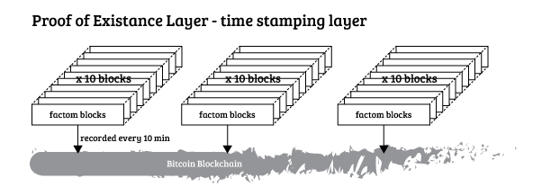
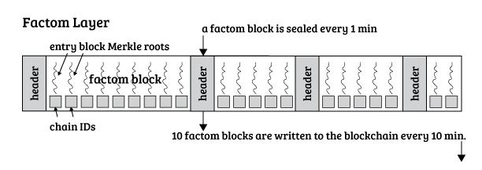
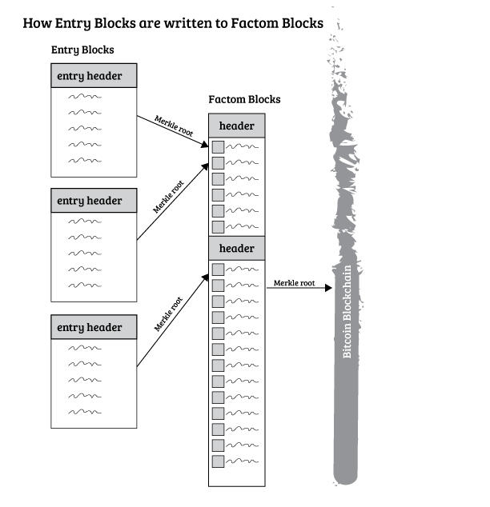
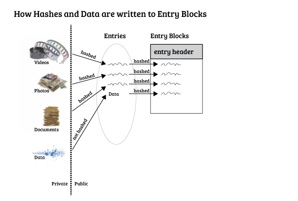

Factom
============

Abstract
--------

Factom is an open source project which leverages the irreversible security of the Bitcoin Block Chain ("blockchain") to allow users to create their own, personal, provably immutable ledgers. All the users of Factom submit their entries to Factom, where the entries are combined and organized.  The entire set of data is distilled to a single hash every 10 minutes, and that hash is placed in the Bitcoin blockchain.  The data collected by Factom is published both immediately over a peer to peer network of nodes, as well as being downloadable.

Factom secures the entries by creating a hierarchical system of blocks and hashes culminating into a single hash every ten minutes.  This single hash is placed into the Bitcoin blockchain.  These structures holding and securing the entries are shared on a P2P network, using a BitTorrent like protocol.  The structures are arranged in a hierarchy, allowing for compact proofs.  The arrangement also allows users to download only the data subset they are interested in, and still be able to create proofs on their data, such as proofs of the negative (the hash of this document is not in the ledger).
 
Factom is run on a system of distributed servers.  The servers implement a consensus mechanism which supports real time audits, which provide users assurance that the servers are implementing their published policies. Other audits ensure the proper construction of state in real time. This system of audits is referred to as Proof by Audit. 

One objective of the Factom project is to provide users such as Omni Wallet, Counterparty, and Colored Coins a method for leveraging the blockchain to house their data, without bloating Bitcoin.

In addition the Factom project aims to appeal to players not yet leveraging the security of the blockchain such as major banks, exchanges, financial institutions, and governmental actors each of whom have “systems of record” that would benefit vastly by securing their data to the blockchain in a cryptographically auditable way.

Introduction
------------

When Satoshi Nakamoto launched the Bitcoin blockchain he revolutionized the way transactions were recorded. There had never before existed a permanent, decentralized, and trustless ledger of records. Developers have rushed to create applications built on top of this ledger. Unfortunately, they run into a few core problems that were part of the original design tradeoffs when the blockchain was launched:

1)    Speed – because of its decentralized nature, the blockchain takes on average 10 minutes to confirm a transaction. Many applications require multiple confirmations for security.  Many applications can’t deliver a practical user experience with this time constraint.

2)    Cost – the current minimum transaction cost is around 10 Bits (or roughly $0.005 USD). The exchange price of Bitcoins has increased approximately 500% in the last 12 months ending August 2014, and is projected to continue to increase long term. This provides a serious cost barrier to applications that need to manage millions of transactions. (For conversions between USD, BTC, mBTC, and bits, check out this [Bitcoin Price Converter](http://youmeandbtc.com/bitcoin-converter/).) In addition with the propagation of Bitcoin Core 0.10 version “floating fees” are likely to increase transaction fees as the number of transactions continues to increase. https://bitcoinfoundation.org/2014/07/floating-fees-for-0-10/ 

3)    Bloat – the Bitcoin blockchain currently has a 1 MB block size limit which caps it at 7 transactions per second. Any application that wants to write and store information using the blockchain will add to the traffic. This problem has become politically charged as developers seek to use Bitcoin in inefficient ways.

Factom is a protocol designed to address these three core problems. Factom creates a Protocol Stack for Bitcoin 2.0 applications that constructs a simple, standard, effective, and secure foundation for these applications to run faster, cheaper, and bloat-free.

------------

Bitcoin is disrupting the status quo for online payments.  With Bitcoin, payments can be made worldwide without any centralized party.  The success and elegance of Bitcoin has inspired many others to seek ways of decentralizing more than just payment systems.  Many have observed that the blockchain could enable the trading of commodities, trading of assets, issuing  securities, implementing self enforcing smart contracts, crowd sourced loans, etc.  The set of such extended applications is often referred to as "Bitcoin 2.0".

Factom simplifies how Bitcoin 2.0 applications can be deployed.  Factom does so by providing a few simple operators from which many more complicated designs can be built.  Factom extends Bitcoin beyond the exchange of bitcoins to include the recording and management of arbitrary events, and chains of such events.

Consider what any Bitcoin 2.0 application requires:

* A set of public or private events
* An unforgeable ledger recording and ordering entries
* Support for unambiguous audits of the ledger, ensuring internal consistency
* The ability to determine the state(s) of participants based on the ledger

Factom is designed to both meet and support the implementation of systems having these requirements.


Theory of Operation
------------

Factom extends Bitcoin's feature set to record events outside of monetary transfers.  Factom has a very minimal rule set for adding permanent entries.  This is a double edged sword, as it allows data to easily be entered into the record.  The drawback is Factom cannot be relied on to ensure validity.  Factom has a few rules regarding financial compensation for running the network, and some internal consistency rules, but cannot check the validity of statements recorded.

Bitcoin only allows entries which correctly move value from an input to an output.  Having a cryptographic signature is enough for the system to ensure validity.  This is a rule which can be automated, so the audit process is easy.  If Factom were used, for instance, to record a deed transfer of real estate, numerous rules exist for the transfer.  A local jurisdiction may have special requirements for property owned by a foreigner.  A cryptographic signature alone is insufficient to fully verify the validity.  Factom is unable to check legitimacy of such a transfer, and so doesn't try.

Bitcoin miners perform two jobs, amongst others.  First, they resolve a double spend.  Seeing two conflicting transactions which spend the same value twice, they decide which one is legitimate.  The second job they perform is auditing.  Since Bitcoin miners only include valid transactions, one that is included in the blockchain can be assumed to be audited.  A light client does not need to know the full history of Bitcoin to see if value they receive has already been spent.  This has the disadvantage of making Bitcoin very fragile.  A disagreement on auditing will create a chain fork, disrupting the Bitcoin economy.

Factom splits the two jobs: transaction ordering and auditing.  The Factom servers accept entries, and assemble them into blocks.  After a few minutes, the transaction ordering is fixed by the Bitcoin blockchain.  The auditing is a separate process which can be done either with or without trust.  The auditing is critical, since it would be trivial to enter invalid data into an Entry Chain.

With trust based auditing, a light client would trust a competent auditor of their choice.  After an entry was entered into the system, an auditor would verify the entry was valid.  They would submit their own entry signed cryptographically.  The signature would show that the entry passed all the checks the auditor thought were required.  In the real estate example from earlier, the auditor would double check the transfer conformed to local standards.  They would publicly attest that the transfer was valid.

Trustless auditing would be similar to Bitcoin.  If a system were as easy to audit as Bitcoin, it also could be done programatically.  If the rules for transfer were able to be audited by a computer, then an Application could download the relevant data and run the audit itself.  The application would build an awareness of the system state as it downloaded, verified, and decided which entries were valid or not.

Mastercoin has a similar trust model.  Mastercoin transactions are embedded into the Bitcoin blockchain.  Bitcoin miners do not audit them for validity, therefore invalid Mastercoin transactions can be inserted into the blockchain.  The Mastercoin wallet scans through the blockchain and finds potential Mastercoin transactions.  It then checks them for validity, building an interpretation of which addresses own which assets.  It is up to the Mastercoin wallet to do its own auditing.  Software development is a little more forgiving with this arrangement.  If a software bug causes an incompatibility, interpretation can be changed after the fact instead of disrupting ongoing operations.

Bitcoin, Mastercoin, land registries, and many other systems solve a fundamental problem: proving a negative.  They prove something has been transfered to one person, and that it hasn't been transfered to someone else first.  Mastercoin solves this problem by limiting the places where Mastercoin transactions can be found.  Mastercoin transactions can only be found in the Bitcoin blockchain.  If a relevant transaction is not found in the blockchain, it is assumed not to exist and the asset hasn't been sent twice (double spent).

Certain land ownership recording systems are similar.  [[1](http://en.wikipedia.org/wiki/Recording_%28real_estate%29)]  Assume a system where land transfer is recorded in a governmental registry and the legal system is setup so that unrecorded transfers are invalid.  If an individual wanted to check if a title is clear, that no one else claims the land, the answer would be in the governmental registry.  They could prove the negative; the land _wasn't_ owned by a 3rd party.

In both of the above cases, the negative can be proven because only transfers in small search space are recognized.  A land transfer recorded in a different jurisdiction 1000 miles away would not have a valid prior claim in the above example.  In Factom, there is a hierarchy of data classification.  This differs from Bitcoin where every entry is potentially a double spend.  The hierarchy allows Applications to have smaller search spaces than if all Factom data were combined together into one ledger.  A land transfer Application could safely ignore Entries tagged as security camera logs.

Nick Szabo has written about Property Clubs, which have many overlaps of this system.  Here is a nugget from his paper "Secure Property Titles with Owner Authority"

`While thugs can still take physical property by force, the continued existence of correct ownership records will remain a thorn in the side of usurping claimants.` [[2](http://szabo.best.vwh.net/securetitle.html)]


Factom
------------

At its heart, Factom is a decentralized way to collect, package, and secure data into the Bitcoin blockchain.  Factom accomplishes this with a network of federated servers.  These servers rotate responsibility for different aspects of the system.  No single server is ever in control of the whole system, but only a part of the system.  And no server is permanently in control of a part of the system; the responsibility for any part of Factom cycles over the servers.

[Overview](images/Whitepaper---Factom-Complete-System.png)

Factom implements a Protocol Stack for Bitcoin 2.0 Applications.  The layers in this stack are:

1) timestamping Layer

2) Factom Layer

3) Entry Block Layer

4) Entries

5) Applications

**timestamping**



Factom data is timestamped and made irreversible by the Bitcoin network.  User's data is as secure as any other Bitcoin transaction.  A compact proof of existence is possible for any data entered into the Factom system.  The Bitcoin entry is also a key to query a peer-to-peer Distributed Hash Table (DHT, similar to BitTorrent) in order to retrieve all the data which was timestamped.

Data is organized into block structures, and combined via a Merkle trees.  Every 10 minutes, the data set is frozen and submitted to the Bitcoin network.  Since Bitcoin has an unpredictable block time, there may be more or fewer than one Factom timestamp per Bitcoin block.

Bitcoin internal header block times themselves have a fluid idea of time.  They have a 2 hour flexibility from reality [[3](https://en.bitcoin.it/wiki/Block_timestamp)].  Factom will provide its own internal timestamps which conform with standard time systems.  Since Factom places high importance on timestamping, it will be a closely audited part of the system.

The user data ordering will be assigned when received at the server.  Factom organizes the submitted entries into blocks.  The block time for Factom is a minute.  On closing, the federated server network generates consensus and and the entries that are part of that block are timestamped to that minute.   

As a general note, the data could have existed long before it was timestamped.  An application running on top of Factom could provide finer and more accurate timestamping services prior to entries being recorded in Factom.  The Factom timestamp only proves the data did not originate after the Factom timestamp.

The Merkle Root for the Factom block (effectively a timestamp) is entered into the Bitcoin blockchain with a spending transaction.  The spend includes an output with an OP_RETURN.  This method is the least damaging to the Bitcoin network of the various ways to timestamp data [[4](http://bitzuma.com/posts/op-return-and-the-future-of-bitcoin/)].  The first eight bytes of the available 40 following the OP_RETURN code would be a designator tag.  The designator tag indicates the transaction could be a Factom entry.  Other qualifiers are required, but the tag eliminates most of the OP_RETURN entries that would otherwise need to be inspected.

The Merkle Root timestamp will be entered into the Bitcoin blockchain by one of the members in the federation.  The server delegated to timestamp the federation’s collected data creates a small BTC transaction.  The transaction will be broadcast to the Bitcoin network, and be included in a Bitcoin block.  Bitcoin transactions that look like Factom entries, but are not spent from an address known as a Factom server will be ignored.

Bitcoin blocks are generated with a statistical process, as such, their timing cannot be predicted.  This means that the timestamping done for entries within Factom is only roughly bound by the entries inserted into the Bitcoin blockchain, and thus Bitcoin timestamping system.  The real value of inserting these values  into Bitcoin is to prevent anyone from generating false Factom histories in the future.  Due to bad luck of Bitcoin miners, or slow inclusion of Factom transactions, there could easily be an hour or more between when the Factom state is frozen for a particular Factom block and when the Bitcoin transaction that secures that Factom block is mined into a Bitcoin block.


**Factom Layer**



The Factom layer is the first level of hierarchy in the Factom system.  It defines which Entry Chain IDs have been updated during the time period covered by a Factom Block.  It mainly consists of entries pairing a Chain ID and a pointer to find the Entry Block containing data for that Chain ID.

If an Application only has the Factom Blocks, it can find Entry Blocks it is interested in without downloading every Entry Block.  An individual application would only be interested in a small subset of Chain IDs being tracked by Factom.  This greatly limits the amount of bandwidth an individual client would need to use Factom as a system of record.  For example, an Application monitoring real estate transfers could safely ignore video camera security logs.

Factom servers collect Merkle roots of Entry Blocks and package them into a Factom block.  The Factom block is then hashed by computing a Merkle tree, and the Merkle root is recorded into the Bitcoin blockchain.  This allows the most minimum expansion of the blockchain, yet the ledger itself becomes as secure as Bitcoin itself.

**Entry Block Layer**



Entry Blocks are the second level of hierarchy in the system.  Individual Applications will pay attention to various Chain IDs.  Entry Blocks are the place where an Application looking for transactions can expand its search from a Chain ID to discover all possibly relevant entries.  

There is one entry block for each updated Chain ID per Factom block.  The Entry Blocks contain hashes of individual Entries.  The hashes of Entries both prove the existence of the data and give a key to find the Entries in the DHT network.  

The Entry Blocks encompass the full extent of possible entries related to a Chain ID.  If an Entry is not entered into a Entry Block, it can be assumed not to exist.  This allows an Application to prove a negative, as described in the Theory of Operation.  

The Entry Block intentionally does not contain the Entries themselves.  This allows the Entry Blocks to be much smaller, than if all the data was grouped together.  Separating the Entries from the Entry Blocks will also allow auditing auditors to be easier.  An auditor can post Entries in a separate chain which approves or rejects Entries in a common chain.  The audit can add reasons for rejection in Entry.  If an Application trusts the auditor, they can cross reference that the auditor has approved or rejected every entry, without knowing what the entry is.  The Application would then only attempt to download the Entries which passed the audit.  Multiple auditors could reference the same Entries, and the Entries would only exist once on the DHT.  Some entries are expected to be larger than the mere 32 bytes a hash takes up.  Lists of things to ignore do not have to have the full object being ignored for an Application to know to ignore it.

An Entry detailing the specifics of a land transfer would be entered into a chain where land transfers of that type are expected to be found.  One or more auditors would then reference the hashes of land transfer in their own chains, adding cryptographic signatures indicating a pass or fail.  The land transfer document would only need to be stored once, and it would be referenced by multiple different chains.  

**Entries**



Factom Chains are chains of entries that that reflect the events of an application.  These sequences are at the heart of Bitcoin 2.0.  Defining what an event is, and what is required for following events is basic to all event sequences (even outside of Bitcoin 2.0).  Factom Chains document and validate these event sequences to provide an audit trail that can prove an event sequence occurred.  

**Applications**

Applications are possibly distributed applications running on top of Factom to provide additional services.  For example, one might imagine a trading engine that processes transactions very fast, with very accurate timestamping.  Such an application may none the less stream transactions out into Factom chains to document and secure the ledger for the engine.  Such a mechanism could provide real time cryptographic proof of process, of reserves, and of  communications.

Another application may provide an exchange of Bitcoin or even conventional credit cards for Factom tokens.  Using such a "Vending Machine", users could buy entries to be used in Factom without ever owning the Factom Tokens that drive the Factom servers.  And yet such a service is decentralized, in the sense that no application is forced to use a particular "Vending Machine," even if such applications are run by centralized parties.

-----------

Factom Chains
---------------

**Naming Chains**

Factom allows entries to be grouped under a ChainID.  The ChainID is computed from a Name, which is defined as a list of byte arrays.  See figure **How to compute a ChainID**.  While Factom records the Name, and Factom provides tools to search for chains by Name rather than ChainID, under the current design Factom doesn’t use them in the structures it builds.

This convention of creating a ChainID by hashing a set of byte arrays allows for the structuring of chains by Factom users in a way that is transparent to Factom and other users.  Users can even use the same naming conventions, but by making simple modifications, insure that there is no intersection between their chains and other chains.  Consider the following path: 

* MyFavoriteApp/bin

Where the slash is a convention separating ASCII strings “MyFavoriteApp” and “bin”.  These two strings must be converted to bytes, and there are many options for doing so.  The strings could be encoded in UTF-16, UTF-32, or EPCIDIC.  Each of those would result in entirely different ChainIDs for the same string.  Furthermore, the application could utilize a nonce (an arbitrary number) as the first byte array in their naming convention. (i.e. the byte arrays would be the nonce, followed by “MyFavoriteApp” then “bin”.   The use of a nonce, or a GUID of some sort, allows for instance specific chain addressing that is none the less provable within a specified convention.

**Chain Validation**
Factom doesn’t validate entries; entries are instead validated client side by users and applications.  As long as an application understands and knows the rules a chain should follow, then the existence of invalid entries doesn’t cause any disruption.  Entries in a chain that do not follow the rules can be disregarded by the application. 

Users can use any set of rules for their chains, and any convention to communicate their rules to the users of their chains.  The first entry in a chain can hold a set of rules, a hash of an audit program, etc.   These rules then can be understood by applications running against Factom to remove invalid entries client side.

An enforced sequence can be specified.  Entries that cannot meet the requirements of the specified enforced sequence will be rejected.  However, entries that might be rejected by the script or the app will still be recorded.  Thus users of such chains will need to run the app or script to validate a chain sequence of this type. The FactomChain servers will not validate using the script or app.

Factom’s client side validation has a number of advantages for applications written on top of Factom.  

1) Applications can put into Factom whatever entries makes sense for their application.  

2) Execution of rules is far more efficient, since the only systems running those rules are those systems that care about those rules. 

3) Factom Servers have little knowledge about the entries being recorded.

4) Recording speeds can be very fast, since the number of checks made by the Factom Servers are very few.


*Applications*

Factom enables the Distributed Autonomous Applications (DAPPs) and Distributed Autonomous Organizations (DAOs) to implement distributed ledgers.  These ledgers distributed applications to maintain an understanding of the past.  But even everyday sorts of uses can be facilitated as well, like simple movie tickets or arcade tokens.  Factom Chains can support:

* Crowd sourcing loans
* Issuing securities and paying dividends
* Powerful scripted chains with functionality like Ethereum, Darkcoin, etc.
* Smart Contracts
* Smart Properties
* Event ticketing

#Discussion

Using Bitcoin to prove the existence of a document (really any digital asset, like a tweet, a web page, a spreadsheet, a security video, a photo, etc.) is a concept that is well known.  (See the references at the end of this document).  And some have even suggested that a service could be created to take a list of signatures, compute a merkle root, place that in the Bitcoin blockchain.  This not only provides the same security, but limits the “blockchain pollution” of pushing a hash into the blockchain for every signed document.  There are at least a couple of online websites that provide these services.

Factom provide for simple “proof of existence” entries.  In addition, Factom provides proof of transformation, i.e. a progression of entries in a Factom Chain.  Factom implement validation scripts that allow for chains of notarized entries.   Factom can be used to implement token systems, asset trading systems, smart contracts, and more.   A federated set of FactomChain servers provide for real time audits, easy transfer from one FactomChain server to another, reduced blockchain pollution, and other benefits.

Bitcoin implements a strict, distributed method for the validation of transactions, where anyone can validate each transaction, and the validity of every input into a transaction can be verified.  Because each transaction is authorized via cryptographic signatures, no transaction can be arbitrarily reversed.  Furthermore, the meaning of each transaction is defined as a validation of the input values (amounts of bitcoin) for each transaction.

The Bitcoin protocol is transactionally complete.  In other words, the creation and distribution of Bitcoins through transactions is completely defined within the Bitcoin protocol.  Transactions (which specify movement of bitcoin) and block discovery (which move bitcoin via mining fees and provide block rewards) are the only inputs into the Bitcoin Protocol, and nothing leaves the Bitcoin Protocol.  In other words, the 21 million Bitcoin that will ultimately exist will always and forever exist within the protocol.  (Well, at least until side chains are implemented, which will provide additional movement of Bitcoin in and out of side chains.)

Many different groups are looking to find ways to leverage the Bitcoin approach for managing other sorts of transactions besides tracking bitcoin balances.  For example, the trading of assets such as houses or cars can be done digitally using Bitcoin.  Even the trading of Commodities such as precious metals, futures, or securities might be done via clever encoding and inserting of information into the Bitcoin blockchain.  

Efforts to expand Bitcoin to cover these kinds of trades include Colored Coins,  Mastercoin, and Counterparty.  Others seek to build their own cryptocurrency with a more flexible protocol that can handle trades beyond currency.  These include Namecoin, Ripple, Etherium, BitShares, NXT, and others.  And of course Open Transactions uses Cryptographic signatures and signed receipts and proof of balance for users (i.e., a user does not need the transaction history to prove their balance, just the last receipt).

A FactomChain seeks to gain the ability to track assets and implement contracts, while securing the advantage Bitcoin’s security via Bitcoin blockchain.  Instead of inserting transactions into the blockchain (viewed as “blockchain pollution” by many), Factom keeps most information off blockchain.  Furthermore, the FactomChain provides a record keeping system that minimizes the information any actor has to maintain to validate their Factom of interest.  In short,   Factom utilize a combination of mathematical proofs and hashes within the Factom, while inserting the least amount of information into blockchain.  The goal is to create an system of records whose audit trails can prove the interactions of FactomChain users.

A user only needs the artifacts of the FactomChain of interest rather than the full set of Factom maintained by the FactomChain servers.

Of course, the FactomChain can notarize documents, providing proof of their existence at a point in time, and validating their construction (any modification will be detected). In addition, a FactomChain provides a history that proves a series of events occurred. The FactomChain is a series of entries that form a chain of time-stamped events, providing a provable history.  This allows a FactomChain to implement smart contracts and even alternate currencies.  All of which can clear instantly (assuming trust in the FactomChain servers), and within minutes once a Factom entry is secured via the blockchain.

The FactomChains are maintained on a set of federated, independently controlled FactomChain servers.  Factom borrows from the concept of Private Chains, and allows for reactive security by limiting the ability of any FactomChain server to fail to log entries without immediate detection by not only the other FactomChain servers, but by the users themselves.  And like Open Transactions, all links in a chain are secured with cryptographic signatures; there is no opportunity for a FactomChain server to insert a bogus transaction.

Furthermore, a FactomChain is largely left ignorant of the significance of any transaction.  The management and backing of any FactomChain is left to the users of the service.  The FactomChain is an automated, powerless, and disinterested party to the transformations of a particular FactomChain.

The FactomChain concept is designed to allow many different protocols and rules to be run in parallel within data structures designed and implemented by its users.  At the same time, the integrity of the system is secured with the Bitcoin blockchain.  Factom also limits the amount of “pollution” to the blockchain that would result if the same data and information were encoded into Bitcoin Transactions.  Additionally, the FactomChain seeks to reduce the overhead of a single blockchain for sets of transactions that have little to do with one another.  In other words, while Bitcoin benefits from thousands of computers holding the full blockchain, many applications simply need to be auditable, with far fewer systems holding the entire Factom History.  Thus Factom significantly reduces the resources required to process transactions while providing nearly instant transaction clearing.  Federated FactomChain Servers provide for distributing FactomChain processing, load balancing, real time audits to insure honesty, and redundancy to insure availability.

Initially, FactomChain servers will provide APIs to query information from the FactomChain as needed.  Tools for analyzing the FactomChain and torrents for distributing the FactomChain will also be provided.  As technologies such as MaidSafe and the SAFE Network come online, then FactomChain data can be published there in a way that insures all the Factom Blocks are available going forward, despite the fate of any particular FactomChain Server.

Yet even if the data in FactomChain servers expand to many terabytes in size, the validity of Factom Entries and particular Factom Chains are only going to require a small portion of that data.

#How Factom Works


The proof of existence hashes are held within a series of Factom Blocks.  Every so often, the current Factom block is hashed, and that hash is inserted into the Bitcoin blockchain, as shown by Figure 1.  The periodic hash is all that is inserted into the blockchain.  With the single hash, the Factom Block can be provably unalterable (as it would break the hash recorded in the blockchain).  We are looking at different ways to create a link to this hash from the Factom block.

A Factom Block is created immediately after the previous Factom Block is slated to have its Hash submitted to the blockchain.  A new Factom Block begins with a Block ID (one greater than the last).


As each Factom Entry is submitted, it is added to the Factom Block, along with a type, and a timestamp.  For a simple proof of existence entry, the type will be 0.  Other types provide indexes and information that link to information held in entries and chains.

#A Simple Factom Entry

Any number of Factom entries can be added to a Factom Block, and remain secured by the Bitcoin blockchain.  This vastly reduces the overhead of Factom functions on the blockchain without significant loss of security for the Factom entries themselves.  We will discuss how the Factom Blocks are published in a later section.  But suffice it to say that anyone holding a copy of a Factom Block can prove its validity by simply providing the Bitcoin Transaction holding the block’s hash.  The block could not possibly have been constructed after the fact (as fitting a block’s contents to produce an existing hash is quite out of the question).  The Bitcoin Transaction holding the Factom Block’s hash + a copy of the Factom Block will fix the existence of a document at a point in time, and prove the document has not been altered.


Figure 3 shows a simple Factom Entry.  It is composed of structured data (pretty much whatever data the user wants to provide), a reverse hash (a token system used by Factom to control access) and one or more signatures.  A simple entry does not receive any validity checking by the FactomChain server outside of verifying the signatures, if any are provided.  The user provides the entry, structured data, and the signatures (if desired) for the structured data.  If signatures are provided, but do not validate against the structured data provided, then the entry will be rejected. The FactomChain hashes the entry and signatures, then adds that hash to the Factom block (per figure 2).  The Factom block adds the entry type 1 (simple entry) and the timestamp at the Factom block level.

While a user can use the Structured Data section to implement a range of protocols like tokens, smart contracts, smart properties, etc., Factom provide some generic support for these features.  The support for Factom within FactomChain servers is necessary to make the FactomChain Servers auditable in real time for many common functions by its users, and by other Federated FactomChain Servers.   Federated FactomChain servers provide the redundancy and cross checking required for the security of many applications that may wish to run on top of Factom.

# How to Create a Factom Chain

Factom Chains are chains of Factom Entries. A Factom Chain provides the infrastructure for managing smart contracts, token counts, alternative currencies, etc.  

A Start Link begins a Factom Chain.  It looks just like a simple entry, but is typed as a chain.  (The specification for the types for chains is under discussion.) The Structured Description must include a “VScript” entry.   Many chains could be validated privately.  In other words, the validation rules for the chain can be published (and notarized via the Start Link) and any attempt to fraudulently add links to the chain are invalidated by the rules published by the parties starting the FactomChain.  In fact, a reference implementation of an application that validates a FactomChain should be hashed and secured in the Start Link for a FactomChain. That application in combination with the published rules for the FactomChain, rather than the FactomChain server, would be responsible for validating that FactomChain.

Still, there is some use in creating an Account FactomChain supported by FactomChain servers, if for no other reason than to allow the group purchase of Factom entries by users of Factom.   Because of the reduced overhead of Factom, these can be made available at rates far cheaper than Bitcoin Transactions.

An Account FactomChain is enforced by the FactomChain Server.  And it serves as an example for creating user-defined chains.  The Start Link for an Account Factom Chain might look like this:

```
NE Type:     Start Link
Structured Description:    {  
    "vscript" : "<sig> <pubKey> OP_CHECKSIG"
    "val" : 1000 }
Signature:    <sig>
```


The Validation Script must evaluate to true for any link that would directly follow the Start Link in the Factom Chain.  The FactomChain script will implement a subset of the operators defined by Bitcoin, and a few additional operators.  For example, there is no need to implement OP_RETURN, as users can add whatever data they wish to Factom Entries.  Also, the FactomChain will implement a OP_USER.   This operation will return true immediately as far as the FactomChain servers are concerned.  But any following operations will be defined as the user sees fit.  Thus they can provide an application that follows the rules that user cares to implement.  OP_USER is only allowed in a type USER FactomChain.

#Creating Links in a FactomChain


A Factom Link points back to its parent links.  The Validation Script (part of the structured data) must evaluate to true, or the FactomChain service will not add the link to the Factom Block.  A USER FactomChain can possibly accept invalid entries, so it is critical for a FactomChain of type USER to make use of clear FactomChain rules and perhaps a reference application for entry validation in order to ignore invalid entries.

#FactomChain Servers

FactomChain servers are federated under one of the FactomChain servers, the Master Factom server.  They register their Factom Blocks with the Master Factom server, and validate the other Factom servers.  Payments for Factom services are managed with Factom Chains, and accounts are settled by payments that are made periodically.   Payments can be in bitcoin, various alt currencies, or even traditional currencies (though that is less likely).  Half of a payment for Factom services should go to the Factom Server accepting payment, and the other half distributed to all the Factom servers providing auditing services.

Each Factom Server must provide access to their Factom Blocks to the other Factom Servers as well as to their users and customers.  For now, access can be provided via websites and torrents.  In the future, they can be provided by MaidSafe and the SAFE Network.

#Attacks on Factom

FILL THIS OUT

#Bibliography

"Bitcoin." / Mailing Lists. Accessed May 27, 2014. http://sourceforge.net/p/bitcoin/mailman/message/32108143/.

"Could the Bitcoin Network Be Used as an Ultrasecure Notary Service?" Computerworld. Accessed May 27, 2014. http://www.computerworld.com/s/article/9239513/Could_the_Bitcoin_network_be_used_as_an_ultrasecure_Notary_service_.

"Proof of Existence." Proof of Existence. Accessed May 27, 2014. http://www.proofofexistence.com/.

"Virtual-Factom." Virtual-Factom. Accessed May 27, 2014. http://virtual-Factom.org/.

[1] "Recording (real estate)" Accessed Oct 29, 2014. http://en.wikipedia.org/wiki/Recording_%28real_estate%29

[2] "Secure Property Titles with Owner Authority" Accessed Oct 29, 2014.  http://szabo.best.vwh.net/securetitle.html

[3] "Block timestamp" Accessed Sep 12, 2014. https://en.bitcoin.it/wiki/Block_timestamp

[4] "OP_RETURN and the Future of Bitcoin" Accessed Sep 12, 2014.  http://bitzuma.com/posts/op-return-and-the-future-of-bitcoin/


